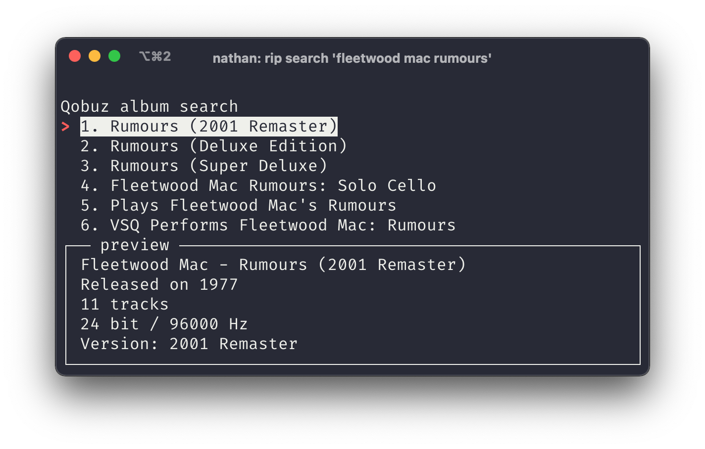

# streamrip

A scriptable stream downloader for Qobuz, Tidal, and Deezer.


## Installation

```bash
pip3 install streamrip
```


## Basic Usage

**For Tidal and Qobuz, you NEED a premium subscription.**

Download an album from Qobuz

```bash
rip -u https://open.qobuz.com/album/0060253780968
```

Download the album and convert it to `mp3`

```bash
rip --convert mp3 -u https://open.qobuz.com/album/0060253780968
```

Search for *Fleetwood Mac - Rumours* on Qobuz

```bash
rip search 'fleetwood mac rumours'
```



Search for *Rumours* on Tidal, download it, convert it to `ALAC`

```bash
rip -c alac search 'fleetwood mac rumours'
```

Qobuz discographies can be filtered using the `filter` subcommand

```bash
rip filter --repeats --features 'https://open.qobuz.com/artist/22195'
```


Want to find some new music? Use the `discover` command (only on Qobuz)

```bash
rip discover --list 'best-sellers'
```


For more help and examples

```bash
rip --help
```

```bash
rip filter --help
```

```bash
rip search --help
```

```bash
rip discover --help
```

```bash
rip config --help
```

**This tool is still in development. If there are any features you would like to see, please open an issue.**

